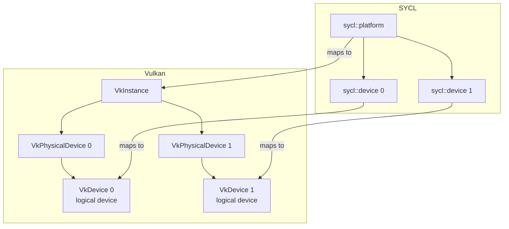
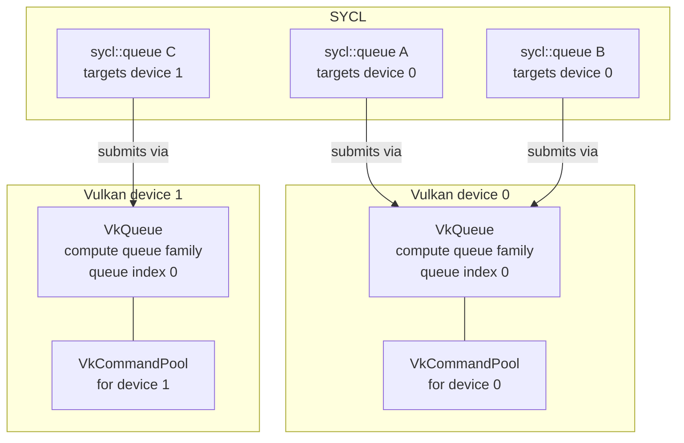
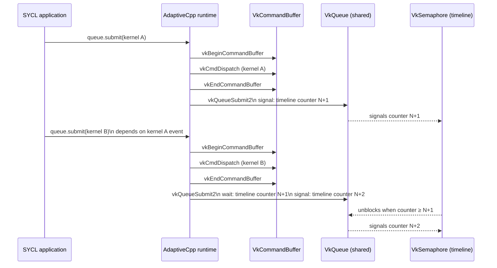
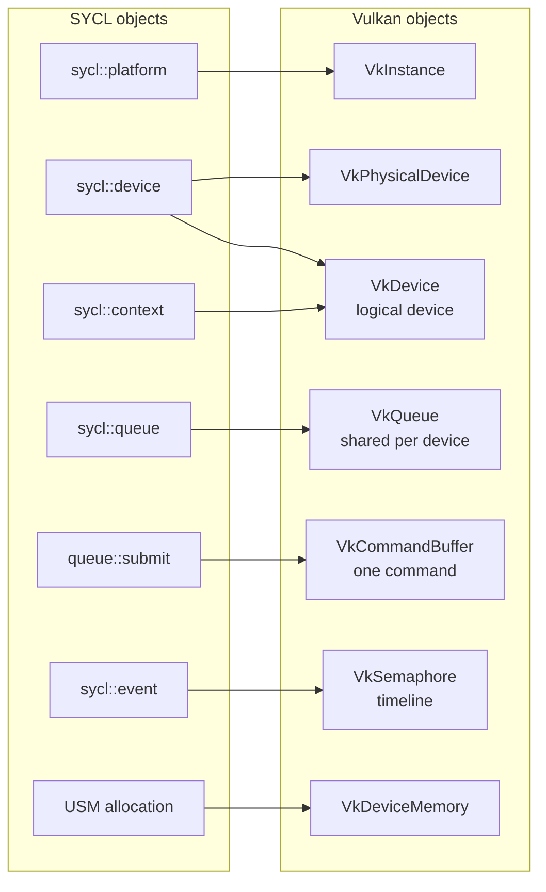

# Vulkan backend – SYCL object mapping

This page documents how SYCL objects are mapped to Vulkan objects in the
AdaptiveCpp Vulkan backend.  The diagrams use
[Mermaid](https://mermaid.js.org/) and can be rendered in any modern Markdown
viewer or the mkdocs site.

---

## 1. Platform and device hierarchy

A `sycl::platform` enumerates the physical GPUs visible to a single
`VkInstance`.  Each `sycl::device` wraps one **logical** `VkDevice` created on
top of a `VkPhysicalDevice`.  One `VkDevice` per physical GPU is created at
backend initialisation time and is shared by every SYCL object that targets
that device.

---

## 2. Queue mapping

A `sycl::queue` bound to a particular device is backed by a **single**
`VkQueue` retrieved from the compute queue family of that device's `VkDevice`.
All `sycl::queue` objects that target the same device share this one
`VkQueue`.  A `VkCommandPool` per device is used to allocate command buffers
(see §3 below).

---

## 3. Command submission and synchronisation

Each `queue::submit()` call (a *command group*) is translated into a
`VkCommandBuffer` containing a **single recorded command** (kernel dispatch,
memory copy, etc.).  The command buffer is submitted to the shared `VkQueue`
via `vkQueueSubmit2`.

Synchronisation between commands (SYCL events / inter-queue dependencies) is
handled exclusively with **timeline semaphores** (`VkSemaphoreTypeTimeline`).
Every submission signals a monotonically increasing counter value on a
per-device timeline semaphore, and any dependent submission waits on that
counter value before starting execution.

---

## 4. Full object map summary

The table below consolidates all mappings described above.

| SYCL object | Vulkan object(s) | Notes |
|---|---|---|
| `sycl::platform` | `VkInstance` | One instance per backend plugin load |
| `sycl::device` | `VkPhysicalDevice` + `VkDevice` | One logical device per physical GPU |
| `sycl::context` | `VkDevice` (shared) | Context maps to the same `VkDevice` as its devices |
| `sycl::queue` | `VkQueue` (shared) + `VkCommandPool` | All queues targeting the same device share one `VkQueue` |
| `queue::submit()` | `VkCommandBuffer` (one command) | Allocated from the per-device `VkCommandPool` |
| `sycl::event` | `VkSemaphore` (timeline) counter value | Monotonically increasing counter per device |
| USM allocation | `VkDeviceMemory` / `VmaAllocation` | Device or host memory via Vulkan Memory Allocator |

